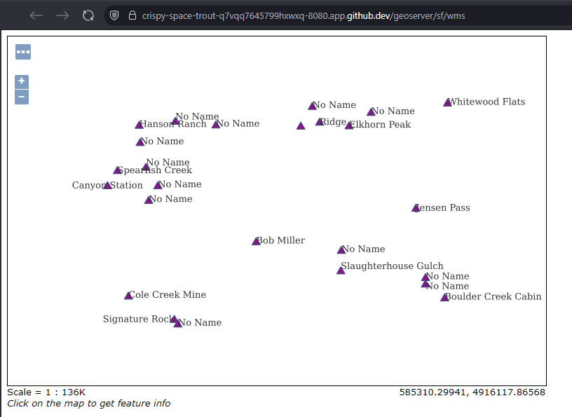
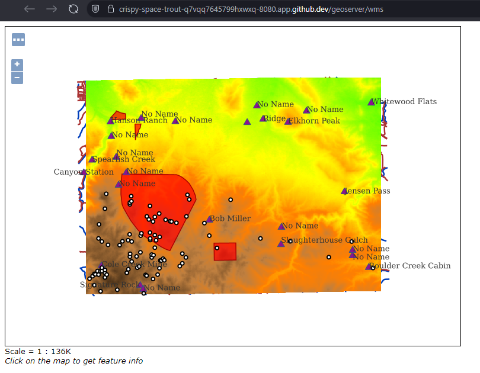

Q1: What is the URL of the WMS GetCapabilities request?

https://crispy-space-trout-q7vqq7645799hxwxq-8080.app.github.dev/geoserver/ows?service=WMS&version=1.3.0&request=GetCapabilities

Q2: What is the URL of the WFS GetCapabilities request?

https://crispy-space-trout-q7vqq7645799hxwxq-8080.app.github.dev/geoserver/wfs?service=wfs&version=1.1.0&request=GetCapabilities

Q3: Submit a screenshot of your updated WFS Layer Preview.

Q4: What does drawing order refer to? Which layer goes on top, the first or the last layer in the list?

    Drawing order refers to how the layers are arranged for display within the layer group. The last layer in the list is drawn on top.

Q5: Submit a screenshot of the Layer Preview of the Spearfish Layer Group when sf:sfdem is listed as the 3rd layer.

Q6: What is the WMS url for the single-tiled request?

https://crispy-space-trout-q7vqq7645799hxwxq-8080.app.github.dev/geoserver/wms?SERVICE=WMS&VERSION=1.1.1&REQUEST=GetMap&FORMAT=image%2Fpng&TRANSPARENT=true&STYLES&LAYERS=spearfish&exceptions=application%2Fvnd.ogc.se_inimage&SRS=EPSG%3A26713&WIDTH=500&HEIGHT=500&BBOX=598881.7715861674%2C4910076.5563299935%2C617015.2435545134%2C4919620.488944912

Q7: What is the WMS url for one of the tiled requests? What is the image size?

https://crispy-space-trout-q7vqq7645799hxwxq-8080.app.github.dev/geoserver/wms?SERVICE=WMS&VERSION=1.1.1&REQUEST=GetMap&FORMAT=image%2Fpng&TRANSPARENT=true&tiled=true&STYLES&LAYERS=spearfish&exceptions=application%2Fvnd.ogc.se_inimage&tilesOrigin=589425.9342365642%2C4913959.224611808&WIDTH=256&HEIGHT=256&SRS=EPSG%3A26713&BBOX=605925.1938559785%2C4919477.329955688%2C607146.8172306882%2C4920698.953330398

    256 x 256

Q8: What is the URL of your coarse resolution sample of a WMTS url? What level does this tile refer to? Notice the differences. What are some of the fields that are unique to this url?

https://crispy-space-trout-q7vqq7645799hxwxq-8080.app.github.dev/geoserver/gwc/service/wmts?layer=spearfish&style=&tilematrixset=EPSG%3A4326&Service=WMTS&Request=GetTile&Version=1.0.0&Format=image%2Fpng&TileMatrix=EPSG%3A4326%3A12&TileCol=1734&TileRow=1037

    This tile is zoom level 12. Some unique fields are TileMatrix, TileCol, and TileRow.

Q9: In the zoomed-out URL, what are the TileCol and TileRow?

    TileCol: 3468; TileRow: 2074

Q10: In the zoomed-in URL, what are the TileCol and TileRow?

    TileCol: 55512; TileRow: 33202

Q11: Why are they so different for the same location in the map?

    The zoomed in URL has many more tiles, so the tile referencing system will need to be a larger range of values.

Q12: Is there a difference in the TileMatrix? %3A is an HTML encoding for a colon, :. What does the number after EPSG:4326 mean?

    The zoomed-in URL has a tile zoom level of 17, compared to level 12 for the zoomed-out URL.
